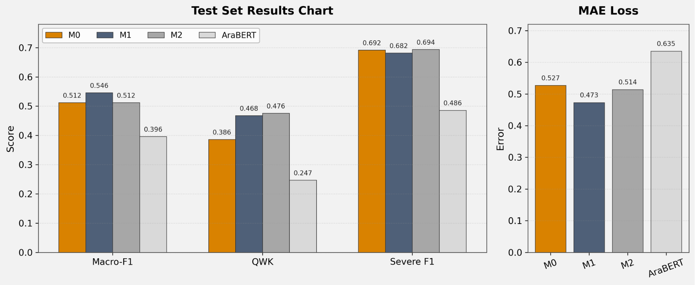
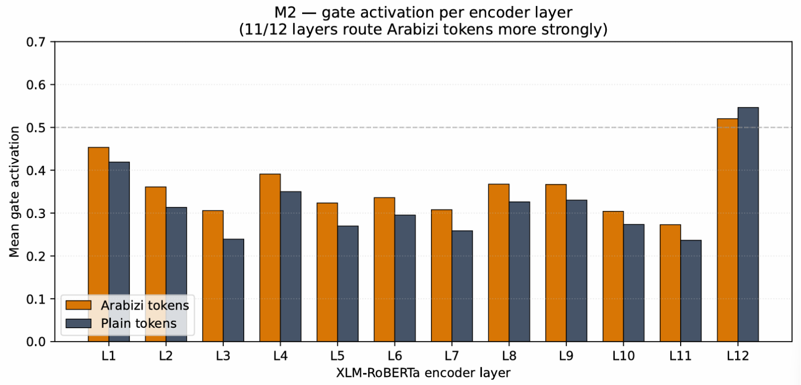

# DarijaDep: Character-Aware NLP for Moroccan Darija

MSc research by **Oumaima Ouayres** on three-level depression-severity text classification in Moroccan Darija social-media posts, including Arabizi and code-switched writing. The project compares XLM-RoBERTa with character features injected before the encoder and character-conditioned gated adapters inside the encoder.

**Status:** archived experiments and documented results. The supplied notebook contains working-session revisions and is not yet a verified end-to-end reproduction workflow. Raw social-media data and model checkpoints are not included.

## Research question

Can character-level features help an XLM-R model handle non-standard spelling and Arabizi digit-letter patterns when predicting the ordered research labels **mild, moderate, severe**?

## Models

| ID | Architecture | Source status |
| --- | --- | --- |
| M0 | XLM-R-base + ordinal head | Present in notebook |
| M1 | CharCNN features projected to 768 dimensions and added to word embeddings | Present in notebook |
| M2 | Shared CharCNN features condition scalar gates on bottleneck adapters after each of 12 encoder layers | Present in notebook |
| AraBERT | `aubmindlab/bert-base-arabertv02` + ordinal head | Present in notebook |

Character features use 32-dimensional embeddings, convolution widths 2/3/4, 64 filters per width, max pooling, and up to 20 characters per subword token. M2 uses a 64-dimensional adapter bottleneck. The backbone is fine-tuned; this is not a frozen-backbone parameter-efficient training claim.

**Method discrepancy:** the report calls the objective CORAL; the source uses `CoralLayer` with `corn_loss` and `corn_label_from_logits`. This package preserves that implementation. See [the reproducibility audit](docs/reproducibility.md) before describing or reproducing the objective.

## Data and annotation

The corpus was collected from Reddit's r/Morocco community using PullPush and keyword-driven collection. Training and validation labels use weak supervision. The author confirmed manual review of the 78-post test input; preprocessing retained 74 posts. The supplied CSV does not retain a separate human-annotation history.

| Final processed split | Mild | Moderate | Severe | Total |
| --- | ---: | ---: | ---: | ---: |
| Training | 1,201 | 1,952 | 459 | 3,612 |
| Validation | 301 | 458 | 117 | 876 |
| Test | 26 | 22 | 26 | 74 |

**Audit limitation:** the supplied processed training/validation data contain five shared distinct texts, and training contains 14 duplicate text rows. No exact processed-text overlap was found between the 74-post test set and either training or validation. These are exact-text checks, not guarantees against near duplicates or user-level overlap.

The character vocabulary is built from training, validation, and test text. This use of held-out text must be disclosed. A train-only vocabulary and deduplicated splits would be a new experiment, not a reproduction of the historical results.

See [data provenance and access](data/README.md).

## Reported results

The following values come from the final **seed-42 saved notebook outputs** on 74 test posts; they were not independently rerun during packaging.

| Model | Macro-F1 ↑ | QWK ↑ | MAE ↓ | Severe F1 ↑ |
| --- | ---: | ---: | ---: | ---: |
| M0 | 0.5117 | 0.3855 | 0.5270 | 0.6923 |
| M1 | **0.5457** | 0.4675 | **0.4730** | 0.6818 |
| M2 | 0.5122 | **0.4762** | 0.5135 | **0.6939** |
| AraBERT | 0.3962 | 0.2466 | 0.6351 | 0.4865 |

M1 has the highest observed Macro-F1. Its reported paired bootstrap difference against M0 is +0.034 with a 95% interval of [-0.038, +0.114], so this is a directional gain rather than established superiority. M2 has the highest observed QWK and severe-class F1, but does not clearly improve overall Macro-F1.

The gate analysis uses **M2 seed 1 on validation data**. Arabizi-marked tokens have higher mean gates in 11/12 layers. This observation does not establish causality or superiority in classification.

Machine-readable transcription: [reported_results.json](results/reported_results.json).

## Inspect the implementation

Open [the archived experiment notebook](notebooks/darijadep_experiments.ipynb) to inspect preprocessing, character extraction, model classes, training, AraBERT, and bootstrap code.

Architecture figures: [M0](figures/m0_architecture.png) · [M1](figures/m1_architecture.png) · [M2](figures/m2_architecture.png). Original architecture PNGs contain transparency and are best viewed on a light background.

The notebook uses Kaggle input/output paths, PyTorch, Transformers, coral-pytorch, NumPy, pandas, scikit-learn, tqdm, and plotting libraries. Reported hardware is an NVIDIA T4, with batch size 16 and maximum sequence length 256. Exact dependency pins and a verified installation command are intentionally not claimed: the export mixes session revisions and the dataset is not distributed here.

## Limitations

- Small test set and noisy weak training labels.
- Manual-review confirmation without a separate annotation trail in the supplied test CSV.
- Exact-text duplication in training and overlap with validation.
- Character vocabulary constructed with held-out text.
- Mixed working-session definitions and unresolved ordinal-method naming.
- Research text categories are not clinical diagnoses; the model is not validated for individual assessment.

## Focused next steps

1. Freeze the historical source, dataset hashes, and saved prediction files.
2. Reconcile objective naming with the actual implementation.
3. Extract one model definition and training engine per historical configuration.
4. Add separate experiments for train-only vocabulary and deduplicated splits.
5. Verify a clean-session run before claiming reproducibility.

## Attribution and research status

This package presents Oumaima Ouayres's MSc research. The supplied report is used as evidence for the research narrative; it is not bundled for public distribution. Publication metadata and coauthor details are not inferred from the thesis or filenames. No publication-status or formal citation claim is made in this package.

No license has been added. Select a code license and establish dataset redistribution permissions before granting reuse rights.
